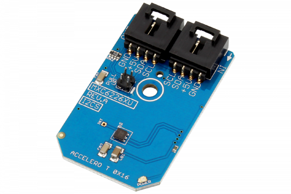

# MXC6226XU

The MEMSIC 6226XU Digital Thermal Orientation Sensor (DTOS) is (was ;)) the world’s first fully-integrated orientation sensor.Its operation is based on a patented MEMS-thermal technology and is built using a standard 0.18um CMOS process.
This Device is available from www.ncd.io 

[SKU: MXC6226XU_I2CS]

(https://store.ncd.io/product/mxc6226xu-digital-thermal-orientation-accelerometer/)
This Sample code can be used with Arduino.

Hardware needed to interface MXC6226XU sensor with Arduino

1. <a href="https://store.ncd.io/product/i2c-shield-for-arduino-nano/">Arduino Nano</a>

2. <a href="https://store.ncd.io/product/i2c-shield-for-arduino-micro-with-i2c-expansion-port/">Arduino Micro</a>

3. <a href="https://store.ncd.io/product/i2c-shield-for-arduino-uno/">Arduino uno</a>

4. <a href="https://store.ncd.io/product/dual-i2c-shield-for-arduino-due-with-modular-communications-interface/">Arduino Due</a>

5. <a href="https://store.ncd.io/product/mxc6226xu-digital-thermal-orientation-accelerometer/">MXC6226XU Thermal Accelometer Sensor</a>

6. <a href="https://store.ncd.io/product/i%C2%B2c-cable/">I2C Cable</a>

MXC6226XU:

The MEMSIC 6226XU Digital Thermal Orientation Sensor (DTOS) is (was ;)) the world’s first fully-integrated orientation sensor.Its operation is based on a patented MEMS-thermal technology and is built using a standard 0.18um CMOS process.

Applications:

• LCD TVs,toys,MP3/4 players,fan heaters,halogen lamps, and irons.

How to Use the MXC6226XU Arduino Library

The MXC6226XU has a number of settings, which can be configured based on user requirements.
          
1.Address calling:The following command is used to call the MXC6226XU sensor to begin the transmission.

            mxc.getAddr_MXC6226XU(MXC6226XU_DEFAULT_ADDRESS);        // 0x160
            
2.Sensor setup:The following command is used to setup the sensor.

            mxc.setUpAccelerometer();
             
3.Output measurement:The following command is used to measure the output of MXC6226XU sensor.             
             
            mxc.Measure_Accelerometer();
